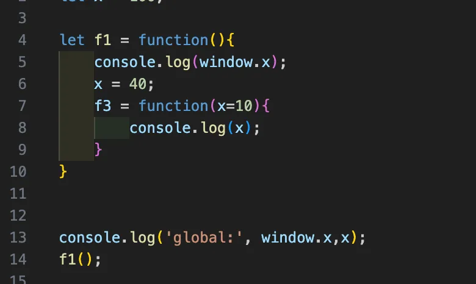

# week1
***
## 2025-03-26

### - React VS Vue
    Vue => MVC기법을 사용하여 양방향 바인딩을 통해 코드작성을 획기적으로 편하게 만들어주었다.

#### 단점   
1. 모델이 많아질수록 데이터변경이 복잡해질 수 있다.
2. 어플리케이션이 복잡해질수록 복잡도가 증가한다.   
---
    React => Flux기법을 사용하며 Vue의 양방향 바인딩 대신 단방향 바인딩을 통해 확장성에 용이하다
   

### 단순히 React가 좋은 것인가?     **No!**   
React: UI 중심의 어플, 컴포넌트 재사용성을 극대화하고 싶은 경우   
Angular: 구조가 잘 정리된 대형 프로젝트에서 더 적합

    단순히 React가 좋은거야!라고 생각하고 있던 나에게 각 라이브러리의 동작 방식을 이해하면서 React에 매몰되는 것이 아니라 상황에 따른 도구 선택이 중요하다는 것을 알게 됐다.
***
## 2025-03-27
### - closure 함수
    out variables의 생명권을 가지고 있는 함수   
   

f1함수가 끝이 나면 메모리에서 제거돼야하지만 f3함수가 전역 선언 되어서 x(out variables)를 붙잡고 있으므로 사라지지 않는다.   

### - 호이스팅
    인터프리터가 코드를 실행하기 전에 함수, 변수, 클래스 또는 임포트(import)의 선언문을 해당 범위의 맨 위로 끌어올리는 것처럼 보이는 현상을 뜻합니다.

### - 동기 및 비동기
* **동기**    
순차적으로 코드가 진행되는 방식   
* **비동기**  
 코드가 동시에 진행되는 방식   
 ### - Common Js & ES6 모듈
 * **CommonJS**   
 require/exports를 사용하여 모듈화 (동기식)   
 * **ES6모듈**   
 import를 사용하여 모듈화 (비동기식)   
***
## 2025-03-27
### - 함수(Function)와 생성자(Constructor)의 차이   
#### 함수 ( Function ) 
```
function Exam() {
    kor = 1;
    eng = 3;
    math = 2;

    console.log(kor, eng, math);
}

let exam1 = Exam(); // ✅ 함수 호출
console.log(exam1); // undefined
console.log(window.kor, window.eng, window.math); // 1 3 2 (전역 변수로 등록됨)
```
### **📌 특징**

✔ `Exam()`을 함수로 실행하면, **`this`가 글로벌 객체(`window` 또는 `globalThis`)를 가리킴**

✔ `kor`, `eng`, `math`는 **명시적으로 `var`, `let`, `const` 없이 선언되었으므로 전역 변수로 등록됨**

✔ `exam1`에 아무것도 반환되지 않으므로 `undefined`가 됨
   
#### 생성자 (Constructor)
```
function Exam() {
    this.kor = 1;
    this.eng = 3;
    this.math = 2;

    console.log(this.kor, this.eng, this.math);
}

let exam2 = new Exam(); // ✅ 생성자 호출
console.log(exam2); // Exam { kor: 1, eng: 3, math: 2 }
```
### **📌 특징**
✔ `new Exam()`을 실행하면, **새로운 객체(`this`)가 생성됨**

✔ `this.kor`, `this.eng`, `this.math`는 **객체의 프로퍼티로 등록됨**

✔ `exam2`에는 **객체가 반환되므로 속성(`kor`, `eng`, `math`)을 사용할 수 있음**
   
### - Has-A 상속 | Is-A 상속
#### Has-A 상속
> "팔, 다리, 눈, 펀치 기능을 하나씩 가져와서 조합하는 방식"
> 
> 
> (여러 개의 개별적인 기능을 가져와서 조합)
>
#### Is-A 상속
> "길 가다가 눈만 붙이면 되는 로봇을 발견해서, 로봇을 그대로 데려와서 눈만 붙이는 방식"
> 
> (이미 존재하는 로봇 클래스를 상속받아 확장)
>
   
## **🎯 언제 `Has-A`를, 언제 `Is-A`를 사용할까?**

✅ **재사용성과 확장성을 고려하면 `Has-A`(구성) 방식이 더 유연함**

✅ **부모-자식 관계가 명확할 때(`Is-A` 관계가 자연스러울 때)만 상속을 사용**

✅ **대부분의 경우, `Has-A`(구성) 방식이 유지보수에 유리**

✅ **JavaScript, React 등에서는 `Has-A` 방식(Composition)을 더 선호** 🚀