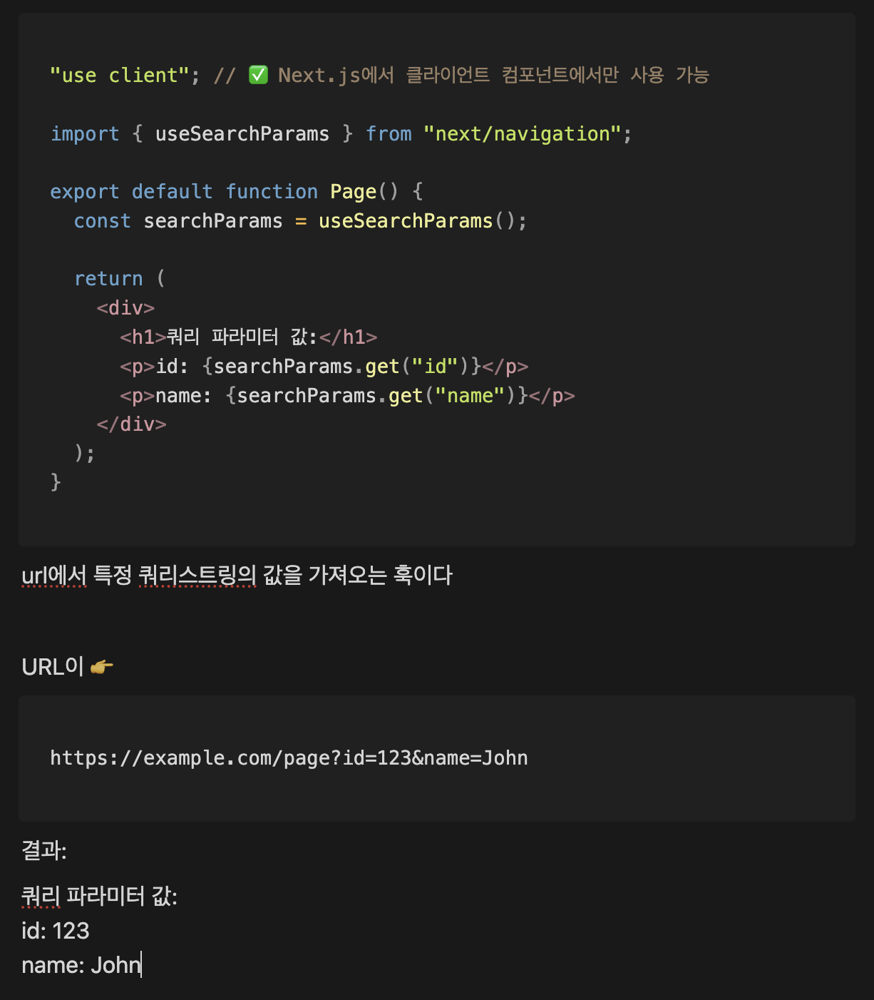

# week2

## 2025-03-31

## 데이터베이스 모델링

### - 데이터베이스

    말 그대로 데이터의 베이스이다. 데이터를 기반에 두어서 효율적으로 꺼낼 쓸 수있게 도와주는 시스템

### - 시스템이란?

    유기적으로 역할자들이 결합된 집합체

    내가 이해한 바로는 어떤 사건에 대한 역할 분담이 되어 있는 집합체라고 받아들였다.

### - 데이터 모델링 과정

### - 개념적 설계

    어떤 데이터를 저장할 지 결정하는 단계

    E(ntity)R(elationship) 다이어그램을 사용

- Entity  
   데이터를 저장하는 하나의 단위

  다이어그램에서는 네모로 표현됨

- Relationship  
   개체 간의 연관성을 정의하는 요소
  문장으로 말할 때 보통 동사역할을 한다
  회원이 메뉴를 **주문**한다 => 주문

  다이어그램에서는 마름모로 표현된다

### - 논리적 설계

> 관계에서 두 entity사이에서 relationship이 1:N관계이면 자식은 N인 부모에게 종속되야 한다.

> 만약 N:N관계이면 독립적인 테이블을 만든다.

> 정규화로 태어난 자식은 부모의 참조 키를 가지고 있어야 한다.

    후보키 => 주키로 될 수 있겠다
    대체키 => 후보키들 중 주키가 아닌 키
    대리키 => 주로 주키로 사용된다. (예: 아이디)

### - 정규화

    중복을 제거하는 과정

### - 1정규화

    도메인에는 원자값이 들어가야 한다
    도메인: 속성   원자값: 하나의 값
    => 속성에는 하나의 값이 들어가야 한다

## 2025-03-31

### - 2정규화

    부분적 함수 종속을 제거하는 것
    함수: 키
    함수 종속: 키로 식별되는 속성들

### - 3정규화

    이행(적 함수)종속을 없애는 것
    a가 b를 좋아해 b가 c를 좋아해 a가 c를 좋아해? 이상
    a,b / b,c로 테이블 분리
    FK는 이행적 함수이다

### - BCNF(Boyce-Codd Normal Form)

    3.5정규화라고 볼 수 있다
    모든 결정자가 후보키여야한다.

### - 4정규화

    다치 종속을 제거한다
    논리 설계에서 relationship이 n:n관계이면 테이블을 분리를 하기 때문에 4정규화를 위반할 일은 없다

## 2025-04-03

## 백엔드 클린아키텍쳐

### - Entity

    데이터의 틀
    데이터 모델이라고 생각

### - Repository

    데이터 접근 계층
    데이터 베이스로부터 데이터를 불러오거나 보낸다

### - Usecase

    업무 로직
    ex) 메뉴리스트를 보여줘 / 좋아요를 누를거야
    프론트단과 백단 사이에서 dto를 entity로 바꾸거나 entity를 dto로 바꿔주는 작업을 한다!

### - DTO (Data Transfer Object)

    프론트가 데이터를 가져와서 사용하기만 하면 되게 변환된 데이터 형태

## 2025-04-03

### - scss란

    css의 추가 기능 확장판
    nest형태의 css를 사용하면 돌아가기는 하지만 webpack에서 오류가 난다.
    그래서 scss를 설치하고 사용 할 수 있다.

### - export 와 export default의 차이

- export  
   하나의 파일에서 여러개의 클래스를 export할 수 있다.  
   import받을때 {}를 사용하여 어떤 클래스를 가져올지 명명해줘야 한다
- export default  
   하나의 파일에서 하나의 클래스만 export가 가능하다  
   import받을떄 {}없이 가져온다.

### - useSearchParams

    query string을 어떤 값을 설정할지 정하면서 해당하는 값을 가져 올수도 있다.

### - 일반 function과 arrow function의 차이

    1. this 바인딩 방식

        일반 함수의 경우 호출한 주체에 따라 바뀐다.
        arrow function은 자신을 둘러싼 외부 스코프의 this를
        고정해서 사용한다.
        즉 항상 상위 컨텍스트의 this를 사용함

    2. arguments 객체

        일반 함수는 모든 전달 인자를 참조할 수 있다.
        arrow function은 arguments가 존재하지 않는다.

    3. 생성자 함수 사용 여부

        arrow function은 new 키워드로 인스턴스를 생성할 수 없다.

### 언제 어떤걸 사용해야 할까?

    - arrow function
     함수가 단순하고 한줄 짜리 표현일 떄

    - 일반 함수
     this를 명확히 써야 할 때
     arguments를 참조해야 할 때
