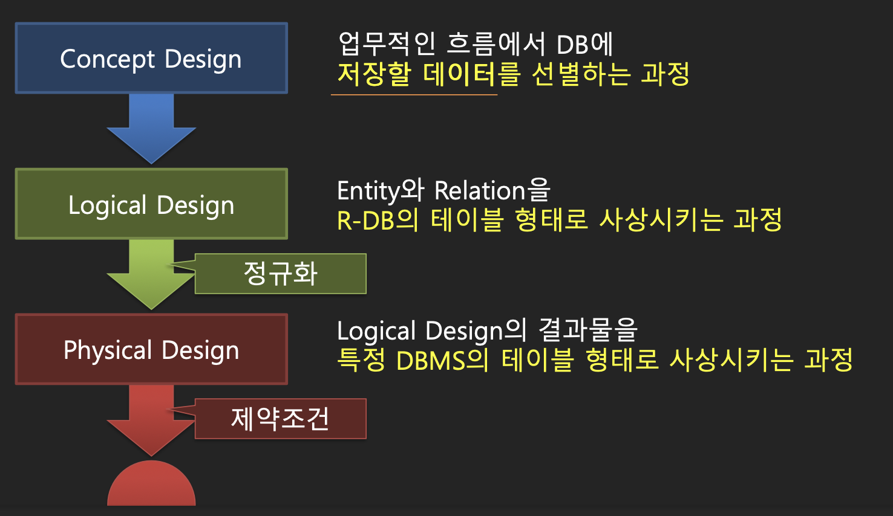

# week2
***
## 2025-03-31
## 데이터베이스 모델링
### - 데이터베이스
    말 그대로 데이터의 베이스이다. 데이터를 기반에 두어서 효율적으로 꺼낼 쓸 수있게 도와주는 시스템
### - 시스템이란?
    유기적으로 역할자들이 결합된 집합체

    내가 이해한 바로는 어떤 사건에 대한 역할 분담이 되어 있는 집합체라고 받아들였다.
   
### - 데이터 모델링 과정

   
### - 개념적 설계
    어떤 데이터를 저장할 지 결정하는 단계

    E(ntity)R(elationship) 다이어그램을 사용

* Entity   
    데이터를 저장하는 하나의 단위   

    다이어그램에서는 네모로 표현됨

* Relationship   
    개체 간의 연관성을 정의하는 요소
    문장으로 말할 때 보통 동사역할을 한다
    회원이 메뉴를 **주문**한다 => 주문   

    다이어그램에서는 마름모로 표현된다
### - 논리적 설계

> 관계에서 두 entity사이에서 relationship이 1:N관계이면 자식은 N인 부모에게 종속되야 한다.   

> 만약 N:N관계이면 독립적인 테이블을 만든다.
   
> 정규화로 태어난 자식은 부모의 참조 키를 가지고 있어야 한다.   

    후보키 => 주키로 될 수 있겠다
    대체키 => 후보키들 중 주키가 아닌 키
    대리키 => 주로 주키로 사용된다. (예: 아이디)
### - 정규화
    중복을 제거하는 과정

### - 1정규화
    도메인에는 원자값이 들어가야 한다  
    도메인: 속성   원자값: 하나의 값
    => 속성에는 하나의 값이 들어가야 한다